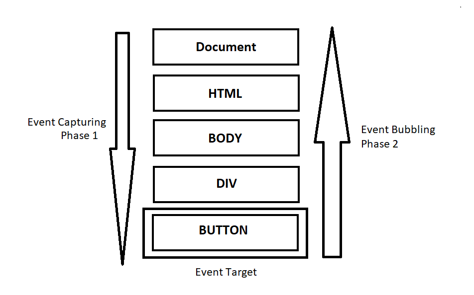

### 
**Proceso de captura (capturing) y propagación (bubbling) de los eventos en Javascript.**

---
***Andrea Joana Martínez Limón 19100212.***

Es común que al desarrollar un sitio web sea necesario escuchar ciertos eventos o acciones de los usuarios para así ejecutar operaciones especificas según la situación. La W3C (también conocido como World Wide Web Consortium o El Consorcio de la World Wide Web) define tres fases en el ciclo de vida de un evento, que son la fase de captura, la fase objetivo y la fase de burbujeo. 

 

De manera simplificada, cuando se activa un evento este desciende desde los elementos principales hasta encontrar el elemento de destino (fase de captura). Una vez que alcana su objetivo comienza el evento en sí junto con sus operaciones relacionadas (fase objetivo), luego asciende entre los elementos (fase de burbujeo) mientras llama a los controladores.

**Fase de captura (Capturing):** Es la primera fase que ocurre durante un evento y suele ocurrir automáticamente siendo invisible para los usuarios. Los desarrolladores también suelen ignorar esta fase y rara vez es modificada, de hecho, al configurar un controlador de evento utilizando las propiedades *on < evento >* (y relacionados), *addEventListener(evento, handler)* (tomando 2 argumentos) o los atributos HTML, esta fase no se ejecutará y se pasará directamente a las fases objetivo y de burbujeo (propagación)
Si queremos capturar un evento utilizando esta fase es necesario agregar explícitamente *{capture: true}* o hacerlo implícitamente utilizando *true* al final del detector de eventos. Existen dos posibles valores para *capture*:
+ Si es false (valor por defecto) entonces el manejador se prepara para la fase de propagación.
+ Si es true, entonces el manejador es preparado para la fase de captura.

**Fase objetivo (Target):** Si bien esta fase es oficialmente reconocida, es dependiente de las otras dos fases y se maneja de manera conjunta. Es decir, tanto la fase de captura como de propagación activarán esta fase al dispararse y comenzar a modificar el elemento objetivo.

**Fase de burbujeo o de propagación (Bubbling):** El burbujeo o propagación de eventos implica ejecutar los controladores del elemento destino y luego ascender hasta los controladores de los elementos padre. Se le conoce como fase de burbujeo por la forma en que las burbujas se elevan en el agua. Esto significa que si tenemos un elemento *< p >* anidado dentro de un *< div >* los controladores se ejecutarán primero en *< p >* y luego en *< div >*, esta secuencia burbujeará hasta llegar a la cima, lo cual incluye, el html, el documento object y el window.

*Nota: Existen eventos que no pueden propagarse, pero suelen ser la excepción a la regla.*

**Extra: Detener la propagación.**
En general, la propagación manda a llamar a todos los manejadores padres o ancestros hasta alcanzar el window, sin embargo, es posible que el desarrollador determine hasta donde puede ascender. Sin embargo, detener la propagación de un evento puede llegar a causar problemas de ejecución en el código por lo que se recomienda no hacerlo al menos que sea estrictamente necesario. 

Los dos métodos para lograr la detención son:
+ ***Event.stopImmediatePropagation():*** Detiene la propagación futura, pero los manejadores del elemento actual se seguirán ejecutando.
+ ***Event.stopImmeadiatePropagation():*** Detiene la propagación futura y en el elemento actual, es decir, después de este método ningún controlador será ejecutado.

